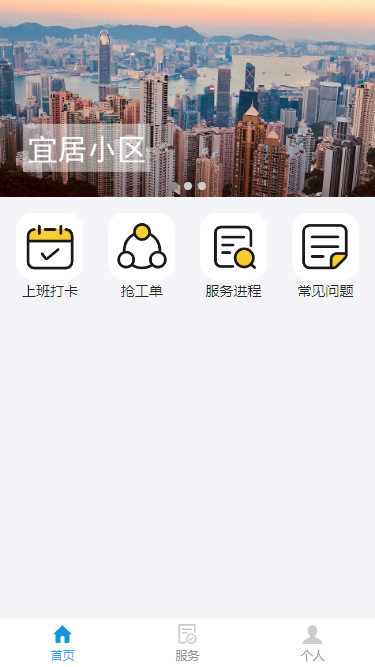
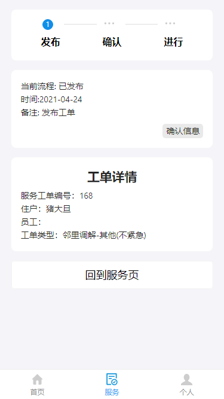
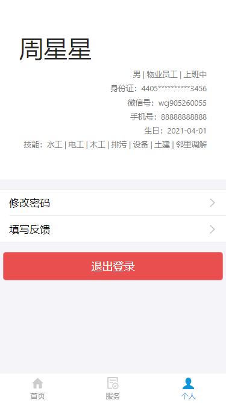

# Property-Management-System-Frontend

This project is initialized with dva. Follow is the quick guide for how to use.

# Demo Preview

## Welcome Page



## Server Page


## ServerInfo Page



## Personal Page



# Provided Scripts

### Start project

```bash
npm start
```

Build project

```bash
npm run build
```

