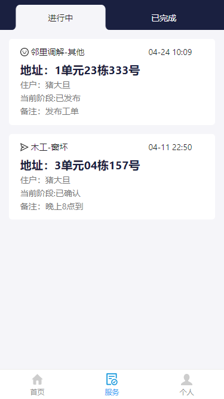

# Property-Management-System-Frontend

This project is initialized with dva. Follow is the quick guide for how to use.

# Demo Preview

## Welcome Page


## Server Page



## ServerInfo Page


## Personal Page


# Provided Scripts

### Start project

```bash
npm start
```

Build project

```bash
npm run build
```

